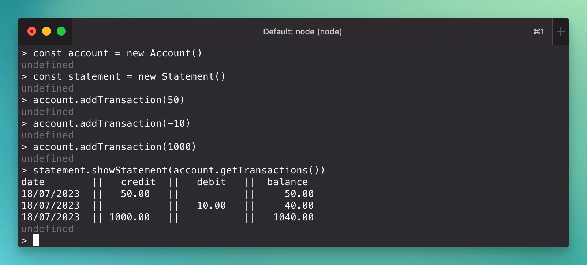
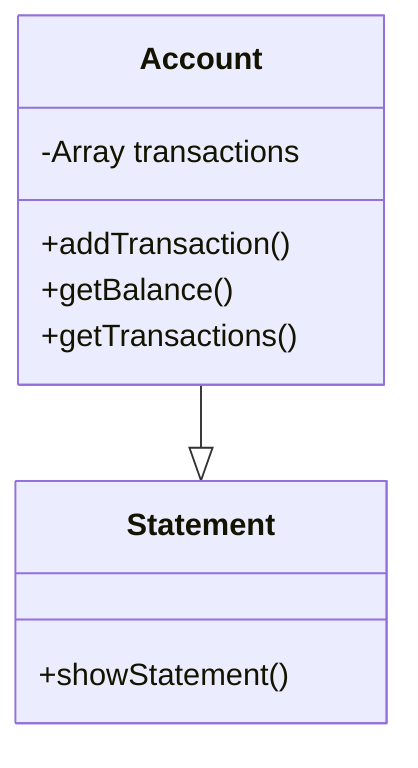

# README

This is a simple backing application that allows a user to interact with their account via the Node REPL.

A client can make deposits and withdrawals, and generate a statement showing their transactions.

## Installation and usage

### Installation

1. Clone the repo to your local machine
2. `$ npm install`

### Usage

1. `$ node`
2. Load the Account class: `.load ./src/account.js`
3. Create a new Account objectL `const account = new Account()`
4. Load the Statement class: `.load ./src/statement.js`
5. Create a new Statement object: `const statement = new Statement()`
6. Add some transactions
  - To add a deposit, enter a positive number: `account.addTransaction(50)`
  - To add a withdrawal, enter a negative number: `account.addTransaction(-10)`
7. Generate a statement: `statement.showStatement(account.getTransactions())`

### Testing

Run the tests: `$ npm run test`.

## Design and background

### Requirements
- Interact with it via the REPL (no CLI needed).
- Data should be stored in memory (no database needed).

### User stories
- As a client, I want to make deposits and withdrawals so that I can manage my money.
- As a client, I want to generate a statement so I can see my account balance, along with a list of dates and amounts of withdrawals and deposits.

### Class design

I created two classes: `Account` and `Statement`. `Account` is initialised with an empty `transactions` array. When `Account.addTransaction()` is called, it pushes a new transaction into the array.

`Statement` takes the output from `Account.getTransactions()` and iterates over the transactions to produce a statement.

### Other considerations
- There was a requirement for dates in the statement to be formatted as `dd/mm/yyyy`. I used `Intl.DateTimeFormat("en-GB", {dateStyle: "short",})` to achieve that, as the default output is in the correct format.
- Because different transaction values result in strings of varying lengths, the statement output initially looked messy. I used `padStart()` to add spaces to the start of the strings to ensure that the columns lined up correctly. 
